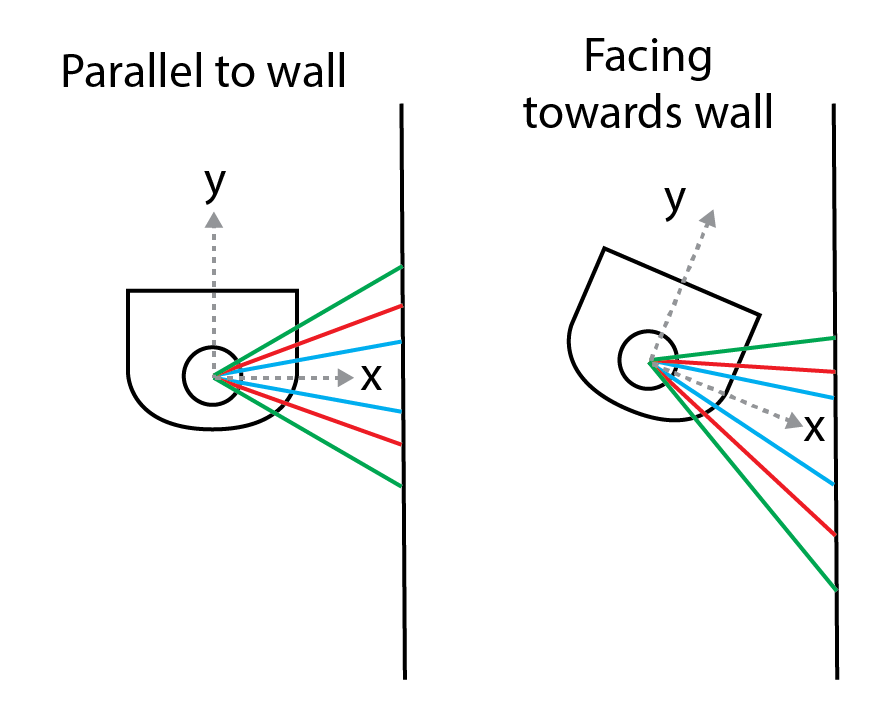
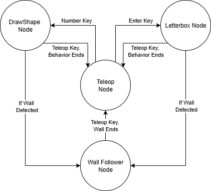

# Computation Robotics Warmup Project 
### By: Andrew Kurtz and Sam Wisnoski

# 1. Introduction

In this project we aimed to develop a foundational understanding of ROS2 and mobile robotics by developing a set of behaviors that range in complexity and sensor use. The first behaviors we developed were Teleoperation and Driving a Shape, by default a square. As we got more comfortable, we added wall following using proportional control and lidar, as well as Letterbox, which is a word drawing program that draws each letter by going to points sequentially. We then integrated three behaviors together using a finite-state-controller. Below, we go into detail about the design decisions for each of these behaviors, as well as reflect on the overall project.

We worked together closely on planning the behaviors and architecture. Then, to ensure we both got a foundational understanding, we each implemented a simpler and more complicated node. Andrew did the shape driving node and wall follower, while sam did the teleop and letterbox. After the base behavior was written, we worked together on the finite-state-machine and write-up. 

#### Running the Code

In order to run the code, please follow the setup for ROS2 + Gazebo enviornments, found on the [2025 CompRobo Website](https://comprobo25.github.io/How%20to/setup_your_environment). Once you have properly set up your environment, you can clone this repository to your ros2_ws. Remember to run `colcon build --symlink-install` and `source ~/ros2_ws/install/setup.bash` after creating the new package found in our repo. 

Lastly, to run the code, initialize the gazebo environment with: 
`ros2 launch neato2_gazebo neato_gauntlet_world.py`
And run one of behavior nodes with: 
`ros2 run -package-name -node-name`


# 2. Behaviors + Finite State Machine 

## 2a. Teleoperation

#### Overview

Our Teleoperation behavior is a simple node that locally reads input from a laptop and publishes a Twist to the 'cmd_vel' topic in response to the input. While running the node, the following keystrokes are taken as input: 
* [W] - Move Forward 
* [A] - Rotate Left 
* [S] - Move Backward 
* [D] - Rotate Right
* Any Other Key - Stop Moving
* [CTRL-C] - Stop the Node

#### Code Design

There are three main functions which help us operate teleop. In our main run_loop, we repeatedly call `self.get_key()` to recieve the most recent keystroke and `self.steer()` to determine what to do with that keystroke. If one of the "movement" keystrokes are entered, we call a generic `drive()` function, which publishes a given linear and angular velocity to the `cmd_vel` topic.


## 2b. Drive Shape

#### Overview

To drive in a shape, we designed the node to drive an arbitrary `n` sided regular polygon where `n >= 3`. The number of sides (`num_sides`) and side lengths (`side_len`) are defined using dynamic ROS parameters, so they can be adjusted when starting the node or mid run. The turn angle per a `num_sides` polygon is calculated geometrically with the math below. If new parameters are set mid-shape, they robot will start the new shape where it is.

```Python
sum_of_angles = (self.num_sides - 2) * math.radians(180)
self.turn_angle = math.radians(180) - sum_of_angles / self.num_sides
```

#### Code Design

The node is implemented using a standard single threaded approach. It uses a `run_loop` method that runs at 10hz and publishes a Twist message to `cmd_vel` with the linear/angular velocity depending on where Neato is within shape. 

To add the ROS parameters to dynamically change the shape through `num_sides` and `side_len`, they are defined using the built in Node methods. A parameter callback method is also defined. When the parameters are updated and the callback is called, it recalculates the turn angle and resets the internal state of the location within shape.

## 2c. Wall Following

#### Overview

The wall follower node is designed to drive parallel along a wall that is within one meter of the Neato. To accomplish, the program must first must detect which side the wall is on, then the Neato's orientation relative to the wall, and finally choose an angular velocity commamnd to correct the direction. 

#### Code Design

To detect the wall side, we chose the simple heuristic that the side with the wall will have more lidar pings. To calculate this, we simply loop through all the lidar points and tally the points between 10 cm and 1 meter on the left and right side, then compare.

To calculate the orientation relative to the wall, we boil the problem down to finding a way measure the error between the current and target directions. This will be used as the input to the proportional controller in the last step. Because we can scale it by a constant in the controller, we only need a value that correlates to the error, not an exact angle difference. This simplifies the problem.

To find this error, we can compare the lidar distances of corresponding angles that mirror across the Neato's x-axis as shown in the diagram below. When the Neato is parallel to the wall, all the corresponding distances (shown in same color) will be equal. If the wall is to the right of the Neato and the Neato is facing towards the wall, the distances in the first quadrant will be greater than the distances in the 4th quadrant. If it is facing away from the wall, the bottom distances will be greater than the top distances. It is the opposite if the wall is to left. 



Finally, the controller can simply set the neato to maintain a constant forward velocity and set the angular velocity proportional to the error as shown the code below. Since counterclockwise is negative angular velocity, we need to negate the result to match our setup.

```Python
msg.angular.z = -self.kp * float(self.error)
```

#### Improvements

There are a number of improvements that could be made to this behavior. If we had more time, we would have added better wall detection logic so that it doesn't need to assume there will always be a wall. This could be done using RANSAC which excels at noisy data. Additionally, we could have implemented turning logic so that once it reaches a corner, it could turn to follow the next wall.

## 2d. Letterbox 

#### Overview

Our last behavior is letterbox. Letterbox uses a keyboard listen that specifically waits for the user to press the "enter" key, at which time it will prompt the user to enter a string of text. The neato will then navigate to the original world frame (0,0) and trace out the provided string, returning to (0,0) between each point. 


Shown above, the Neato traces the letters ABC in simulation. Notice that it traces the individual segments of the letter, which can occasionally make it look choppy. 

#### Code Design

Letterbox has a single subcription to the `\odom` topic, which allows it to read the Neato's odometry data (it's x, y, and z positioning). It also has a single publisher to the `cmd_vel` topic, allowing us to control the robot and draw letters. 

Unlike our other behaviors, letterbox is multi-threaded, allowing for two additional threads running alongside the main ROS loop: a keyboard listener and a letter-drawing loop. The keyboard listener waits for the Enter key, at which point the drawing loop is activated. It prompts the user for a word, then uses the Hershey font library to convert each character into "stroke" data. These "strokes" represent each character as a sequence of line segments, and those segments are broken down into (x,y) coordinate points. If we convert these points into the world frame we can then trace the letter. Because of this multi-threaded approach, the robot to trace letters interactively without blocking on user input.

The core movement logic is handled in `go_to_point()`, which uses simple trigonometry to drive to the (x,y) segmented coordinate points. The function calculates the target angle with atan2, rotates the robot until aligned, then drives forward the required distance. The `\odom` topic is used to track the robot’s current pose and update orientation, with a simple function converting quaternion data converted into yaw. Ither supporting functions include `collect_input()` for user prompts, `_draw_letter()` for tracing each stroke and resetting to the origin after every character, and `drive()` for publishing velocity commands based on linear and angular velocity. 

## 2e. Finite State Machine

#### Overview

The finite state machine starts in teleop mode, where the user can directly drive the robot with the keyboard. From here, the user can switch into other behaviors by pressing different keys: 

- [W][A][S][D]: Manual teleop control
- [3] - [9]: Enters Shape Mode (draws a regular polygon (like a triangle, square, or hexagon) depending on the number key pressed)
- [Enter]: Enter Letterbox Mode (takes user input for a word, then draws each letter one by one)
- [K]: Stop robot
- [Ctrl+C]: Exit the program

While in letterbox, wall follow, or draw shape mode, you can hit any 
teleop key [W][A][S][D][K] to re-enter into teleop mode. Additionally, 
after the letter(s)/shape(s) are drawn, the neato will return to teleop mode. 

If, while drawing a letter or a shape, the neato detects a wall in the way, 
the neato will begin to follow that wall until it reaches the end of the wall, 
where it will again revert back to teleop. 



A basic diagram of the possible state changes is shown above. 

#### Design

The Finite State Controller (FSM) coordinates between teleop (our "main" state) and our three modes using a single publisher, `cmd_vel` (Twist),  and two subscriptions, `scan` (LaserScan) and `odom` (Odometry). Since one of it's behaviors, Letterbox, is multi-threaded, it runs a non-blocking keyboard listener thread and a separate letter-drawing thread alongside the main thread and the 10 Hz ROS timer. The keyboard thread maps keys to actions in `process_key()` (W/A/S/D/K for teleop, 3–9 to set polygon sides and enter shape mode, Enter to start letterbox, Ctrl+C to quit). We use the variable `self.state` to switch between these behaviors. While the keyboard thread handles most of our state changes, our callbacks (cache latest_scan and update position (x, y, yaw)), also provide constant data for state changes. If the robot detects a wall, `check_near_wall()`, then we would initiate a state change from either draw_shape or draw_letter to wall follow. 

State transitions in the FSM are simple and explicit - as mentioned above, using the variable `self.state()` - and each of the behaviors integrated into our FSM matches one of the behaviors described above Teleop (state = 0) is the default, with manual keyboard control. Shape mode (state = 1) alternates straight segments and turns, using timing values derived from polygon geometry and the robot’s speed. Letterbox (state = 2) hands control to the letter thread, which collects input from the user and traces out characters using stroke data. Wall follow (state = 3) uses averaged lidar slices and a PID controller to steer alongside a wall until it hits another wall. The FSM acts as the high-level manager, directing mode switching, sensor-based interrupts, and motion timing, while the supporting functions handle the movement and input of each specific behavior.


# 3. Conclusion

## 3a. Challenges

While implementing the project, there were a few challenges we had to overcome along the way. One of the main ones was integrating all the nodes into a single finite-state-machine node. The reason is they were each implemented seperately, using varied code design techniques. For example, drive square used a single thread with arduino style timing in the run loop, whereas letterbox used multiple threads and sleep commands. We had to think through the easiest ways to integrate both architectures. We settled on 3 total threads. One was for keyboard input. Another for letterbox sleep style drive. Finally, the last was the main thread that maintained the state/transitions and operated teleop, drive square, and wall-following.

Another challenge was detecting transitions usign the Lidar for the FSM. Since this was a warmup project with limited time, we relied on simple heuristics to detect walls such as enough points in front of the Neato or straight ahead. Because of this, our setup doesn't handle edge cases as nicely as if we had more robust perception and sensing logic.

Finally, the sim to real gap was difficult to navigate. Some parameters and algorithms worked well in sim, but less well on the real Neato. To overcome this in some cases, we were able to deal with noisy data through averages. In other cases, it would have taken significant parameter tuning. For this reason, along with limited time, we decided to record the Bag files in sim.

## 3b. Improvements 

There are many improvements we would make given more time. The first is updating the letterbox to draw words out, rather then drawing letters in the same place. While this has its advantages for space efficiency, it is a more satisfying experience to see a word drawn out. 

We would also improve wall following in a few ways. First, adding a more robust perception algorithms to detect walls and corners, such as RANSAC.Additionally, we would update how it handles corners. Currently, in the FSM version, it will stop at a corner. In the individual node it will drive forever and hit the wall. A more robust system would detect would add a turning controller to use when a corner is detected.

Another improvement is adding more varied state transition functions to the finite-state-machine. The two transition functions we currently use are lidar and keyboard based. We could make it more interactive by using the bump sensor as an input. For example, how many seconds it is pressed for could translate to sides of a polygon to draw.

## 3c. Key Takeaways

One of the key takeaways from the project is the basic architecture of ROS and how to use the many built in tools to improve development. On the architecture side, much of our work revolved around reading and writing data to topics. This solidified our understanding of topics, their interface types, an how to handle callbacks. Learning the basic ROS tools and commands also had a learning curve, but once we got used to them they made planning code and debugging much easier. For example, using `ros2 topic echo` to see outputs and RQT to unpack how the nodes and topics interact.

Another takeaway is to plan the broader architecture upfront to make it easier to combine parts into a system. We wrote all the nodes seperately without a plan of how to combine them into the FSM. This made it harder to integrate and involved rewriting parts. In the future, this will be even more important to keep in mind when we write systems with many parts communicating with each other.

